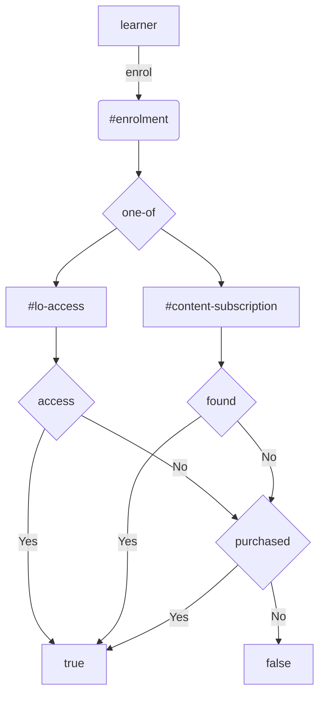

How to access
====

```mermaid
graph TD
    A[learner] -->|enrol| B(#enrolment)
    B --> C{one-of}
    
    C --> D[#lo-access]
    C --> E[#content-subscription]
    
    D --> F{access}
    F -->|Yes| Y[true]
    F -->|No| P[purchased]
    
    E --> M{found}
    M -->|Yes| Y[true]
    M -->|No| P{purchased}
    
    P -->|Yes| Y[true]
    P -->|No| L[false]
```
